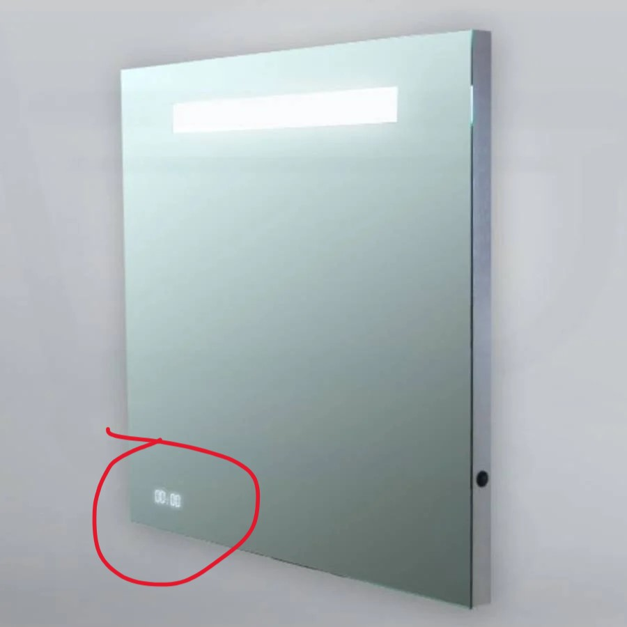
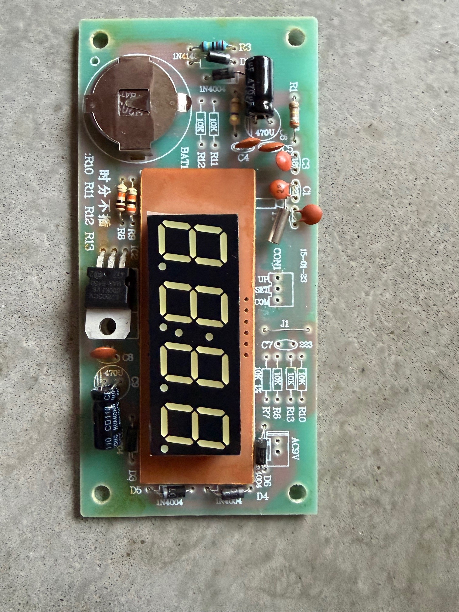
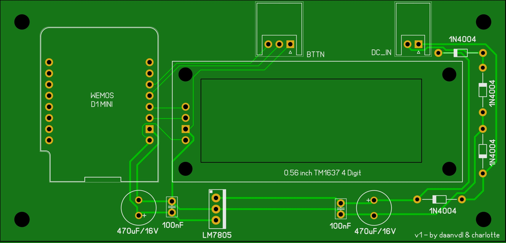

# Clock Module Replacement – Brauer SP-QU60RH / Spiegel Exclusive Line Clock

This project provides a drop-in replacement clock module for the **Brauer SP-QU60RH mirror**, which is also sold in the Netherlands under the name **“Spiegel Exclusive Line Clock”** by various brands such as **Saniclass** and **Samano**.

The original clock module used in these mirrors is known to fail. In my case, it failed **twice**, which motivated me to design a **fully new replacement module**.

I strongly suspect that this clock module is used in many more mirrors, but unfortunately I cannot confirm that with certainty.

 
 

---

## What is this project?

A  drop-in replacement PCB that:

- Fits mechanically and electrically in place of the original clock module  
- Uses simple, easy-to-source components
- Adds functionality that was not present in the original design
- Is designed with reliability and long-term use in mind

The goal is to make otherwise functional mirrors usable again, without relying on hard-to-find or poorly documented original parts.
 


---

## Features

In addition to replacing the original clock module, this design adds several **new features**:

- ⏰ **24-hour time display**
- 🌐 **Automatic time synchronization via NTP**
- 📡 **WiFi connectivity**
- 🕒 **Automatic daylight saving time switching (Europe/Amsterdam)**
- 🔆 **Adjustable display brightness**
- 🔄 **Manual WiFi and NTP reconnect**
- 🌙 **Automatic nightly NTP sync** (if connectivity is available) to ensure accurate timekeeping

---

## Required Hardware

To build this replacement clock module, you will need the following components:

- **Wemos D1 mini (ESP8266)**
- **TM1637 4-digit display (0.56")**
- **2× 470 µF / 16 V electrolytic capacitors**
- **2× 100 nF ceramic capacitors (2.54 mm lead spacing)**
- **4× 1N4004 / 1N4005 / 1N4006 / 1N4007 diodes**

### Connectors

- The **two connectors** used on the PCB were salvaged from the original clock module.
- If you prefer to use new connectors, these can be replaced with:
  - **Right-angle JST-XH 2-pin connector**
  - **Right-angle JST-XH 3-pin connector**

Both options are electrically compatible.

---

## ⚙️ Settings

### WiFi configuration

In the source code, locate the following section:

```cpp
// ---------- WiFi ----------
```

Change the values of `WIFI_SSID` and `WIFI_PASS` to match your own WiFi network credentials.

Example:

```cpp
#define WIFI_SSID "YourWiFiName"
#define WIFI_PASS "YourWiFiPassword"
```

After flashing the firmware with the correct settings, the module will automatically connect to WiFi and synchronize the time via NTP.

---

## 🪞 Compatibility

Confirmed working in:

- **Brauer SP-QU60RH**
- Mirrors sold as **Spiegel Exclusive Line Clock**
  - including brands such as **Saniclass**
  - and **Samano**

It may be compatible with other mirrors using the same clock module, but this is **not guaranteed**.

---

## Motivation

I created this project after repeatedly running into reliability issues with the original clock module. With this replacement, I hope to:

- Reduce electronic waste  
- Help people repair their mirrors instead of replacing them  
- Share a practical and open hardware solution  

I hope this project helps others bring their mirrors back to life.

---

## Contributing

Issues, improvements, documentation updates, and reports of successful use in other mirrors are **very welcome**.  
If you’ve tested this module in a different mirror model, please let me know!

---

